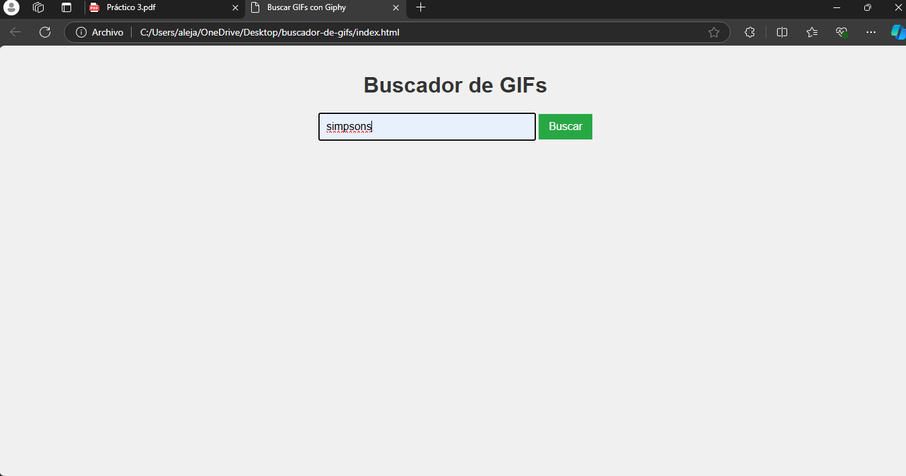
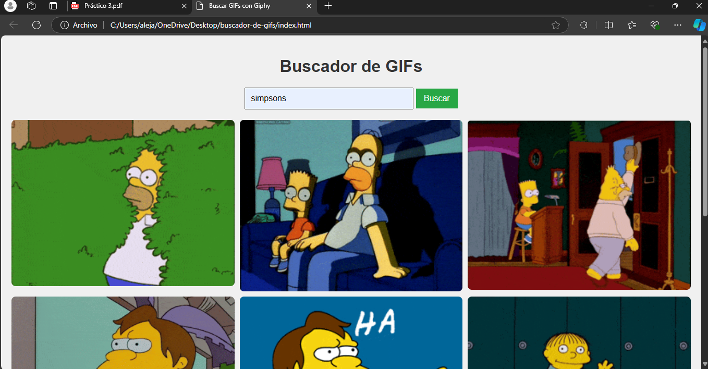
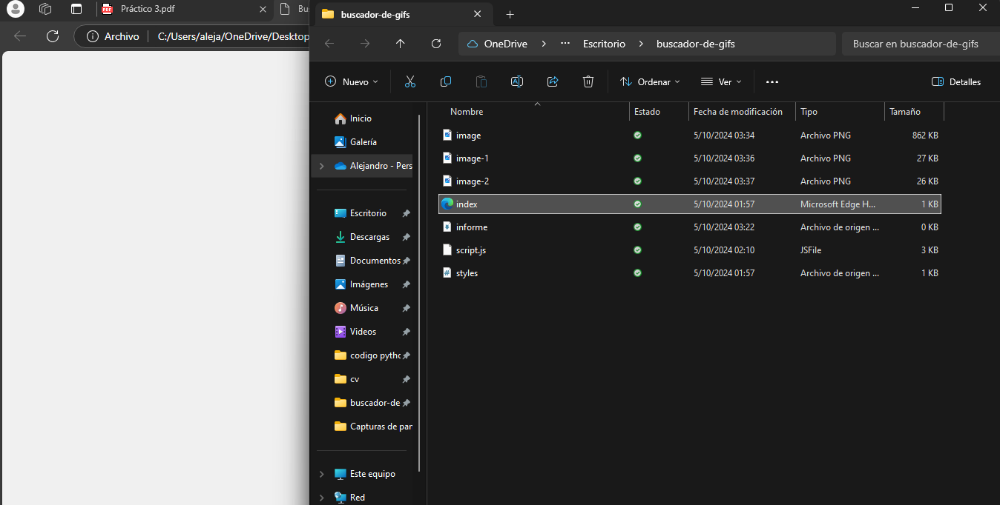
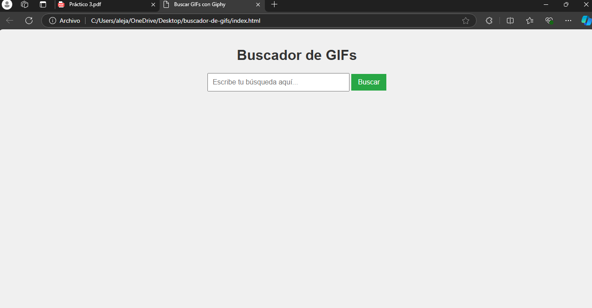

Informe - Aplicación de Búsqueda de GIFs
Descripción del problema
El objetivo de este ejercicio fue crear una aplicación web sencilla que permita realizar búsquedas de GIFs mediante la API de Giphy. La aplicación debía incluir un formulario para ingresar un término de búsqueda y mostrar los primeros 9 resultados en una cuadrícula 3x3 utilizando CSS Grid.

Solución técnica
Para cumplir con los requisitos, la aplicación se desarrolló utilizando HTML, CSS y JavaScript. A continuación, se detallan los aspectos más importantes:

Funciones clave:
fetch() para conectar con la API de Giphy: Se utiliza la función fetch() para enviar una solicitud GET a la API de Giphy con el término de búsqueda proporcionado por el usuario. La respuesta contiene un conjunto de resultados, de los cuales solo se visualizan los primeros 9.

Código clave:

javascript
Copiar código
fetch(`https://api.giphy.com/v1/gifs/search?api_key=YOUR_API_KEY&q=${searchQuery}&limit=9`)
  .then(response => response.json())
  .then(data => displayGIFs(data.data))
  .catch(error => handleError(error));
Visualización en una cuadrícula 3x3: Los GIFs obtenidos de la API se muestran en una cuadrícula 3x3 utilizando CSS Grid. Esto se logra con las siguientes reglas de CSS:

css

.grid-container {
    display: grid;
    grid-template-columns: repeat(3, 1fr);
    gap: 10px;
}
Manejo de errores: Si no se encuentran resultados para la búsqueda, se muestra un mensaje informativo al usuario. También se manejan posibles errores de la conexión a la API.

Implementación
Formulario de búsqueda: El formulario incluye un campo de texto y un botón. Al hacer clic en el botón, se activa el evento submit, que realiza la búsqueda.
fetch() para la solicitud a la API: Al enviar el formulario, se ejecuta la función fetch() que conecta con la API de Giphy y obtiene los resultados.
Mostrar los GIFs: Los GIFs obtenidos se muestran en una cuadrícula de 3x3 mediante una función que manipula el DOM y coloca cada imagen en su lugar.
Capturas de pantalla
1. Vista de la aplicación con resultados:

2. Vista de la aplicación sin resultados:

Criterios de Evaluación
Formulario de búsqueda y conexión con la API de Giphy: El formulario está correctamente implementado y se conecta a la API de Giphy utilizando la función fetch().
Uso adecuado de fetch(): Las solicitudes a la API se realizan de manera eficiente, y se manejan los resultados correctamente.
Implementación de la cuadrícula 3x3: Los GIFs se muestran en una cuadrícula 3x3, ajustándose al tamaño del contenedor.
Calidad del código y documentación: El código está comentado y organizado de manera que facilita su comprensión. Las funciones están claramente separadas por responsabilidades.
Informe: El informe explica el desarrollo y el uso de la API de Giphy, acompañado de capturas de pantalla que muestran el funcionamiento de la aplicación.
